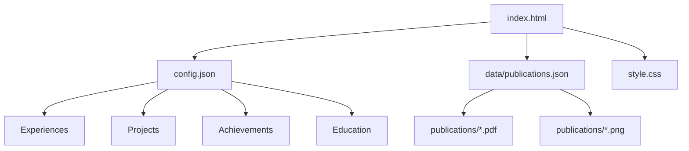

# Taeyong Lee - Personal Homepage

🌐 **Live Homepage**: https://taeyonglee-cv.github.io

Personal homepage of **Taeyong Lee**, showcasing academic publications, research experience, and achievements in mathematical modeling and epidemiology.

## 📁 File Structure

```
/
├── index.html                  # Main homepage (DO NOT EDIT directly)
├── style.css                   # Styling and layout
├── config.json                 # ✏️ EDIT THIS to update content
├── data/
│   └── publications.json       # ✏️ EDIT THIS to update publications  
├── publications/               # PDF files and thumbnails
├── docs/                      # Documentation
└── scripts/                   # Automation scripts
```

## ✏️ How to Edit Your Homepage Content

### 🎯 Quick Edit Guide

**To update your personal information, experiences, projects, achievements, or education:**

1. **Open `config.json`** - This is your main content file
2. **Edit the sections you want to change**
3. **Save the file**
4. **Refresh your browser** - Changes appear automatically!

### 📝 Editing config.json

The `config.json` file contains all your editable content:

#### **Personal Info & Social Links**
```json
{
  "author": {
    "name": "Taeyong Lee",
    "googleScholarName": "Taeyong Lee", 
    "scholarId": "B6KrOaoAAAAJ"
  },
  "social": {
    "github": "https://github.com/holdon1221",
    "linkedin": "https://linkedin.com/in/taeyong-lee7677/",
    "googleScholar": "https://scholar.google.com/citations?user=B6KrOaoAAAAJ&hl=ko"
  }
}
```

#### **Experiences Section**
```json
"experiences": [
  {
    "title": "Current Position",
    "description": "Research focus description"
  },
  {
    "title": "Previous Role", 
    "description": "What you did here"
  }
]
```

#### **Ongoing Projects**
```json
"ongoingProject": {
  "name": "Your Project Name",
  "progress": 75
}
```

#### **Achievements**
```json
"achievements": [
  {
    "name": "Award Name",
    "period": "2024",
    "where": "Organization/Conference"
  }
]
```

#### **Education**
```json
"educations": [
  {
    "degree": "PhD",
    "university": "University Name", 
    "period": "2018-2024",
    "gpa": "3.8/4.0"
  }
]
```

### 📚 Editing Publications

**To update publications:**

1. **Open `data/publications.json`**
2. **Add/edit publication entries:**

```json
{
  "date": "2024-10-18",
  "title": "Your Paper Title",
  "journal": "Journal Name",
  "link": "https://doi.org/...",
  "citations": 5,
  "thumbnail": "publications/your-paper.png",
  "summary": {
    "en": "English abstract...",
    "ko": "Korean abstract...", 
    "fr": "French abstract..."
  }
}
```

3. **Add PDF and thumbnail**: Place files in `publications/` folder

### 🌐 Language Support

The homepage supports 3 languages:
- **English (EN)**: Default
- **Korean (한국어)**: Native language
- **French (FR)**: International audience

All text content in `config.json` will automatically translate via the language buttons.

## 🚀 Running Locally

```bash
# Simple local server
python -m http.server 8000

# Then visit: http://localhost:8000
```

## 📂 File Relationships



## 🛠️ Advanced Features

### Publication Management Scripts
```bash
# Extract metadata from PDFs (if you have Node.js)
node scripts/pdf-abstracts.js

# Update citation counts  
node scripts/scholar-citation-crawler.js

# Generate AI abstracts
node scripts/llm-abstracts.js
```

### Automated Workflow
The `app.js` file contains advanced automation features, but for basic editing, you only need to modify `config.json` and `data/publications.json`.

## 📞 Need Help?

1. **Simple edits**: Just modify `config.json`
2. **Publication updates**: Edit `data/publications.json`
3. **Styling changes**: Modify `style.css` (advanced)
4. **Structure changes**: Modify `index.html` (advanced)

---

**✨ Pro Tip**: Start with small changes in `config.json` to see how the system works, then gradually make more complex modifications!